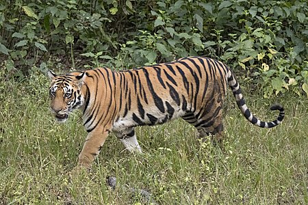
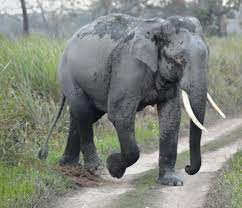
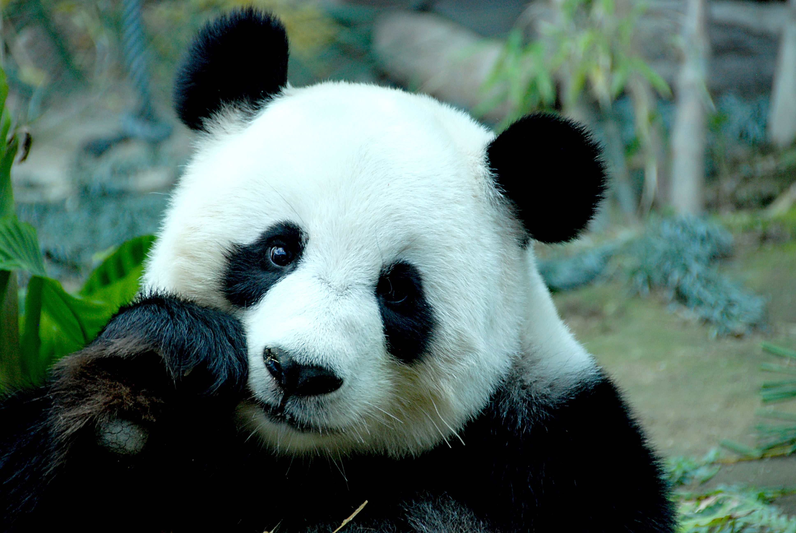

# Tier infos

## Bengaltiger

Als Zoo interessieren wir uns sehr für Bengaltiger, auch bekannt als Indische Tiger. Diese majestätischen Großkatzen sind eine Unterart des Tigers und sind in der Wildnis des indischen Subkontinents beheimatet.

Bengaltiger sind eine bedrohte Art und gelten als gefährdet aufgrund von Lebensraumverlust und Wilderei. Wir als Zoo engagieren uns daher stark für den Schutz und Erhalt dieser Tiere und beteiligen uns an verschiedenen Zucht- und Erhaltungsprogrammen.

Im Zoo bieten wir unseren Besuchern die Möglichkeit, Bengaltiger aus nächster Nähe zu erleben und mehr über diese beeindruckenden Raubtiere zu erfahren. Wir sorgen dafür, dass ihre Bedürfnisse nach artgerechter Haltung, ausreichend Platz und Nahrung erfüllt werden.

Bengaltiger sind sehr anpassungsfähige Tiere und können in verschiedenen Lebensräumen wie Regenwäldern, Graslandschaften und Mangrovensümpfen leben. Im Zoo bemühen wir uns, ihre natürlichen Lebensräume so genau wie möglich nachzubilden, um ihnen ein komfortables und stressfreies Leben zu ermöglichen.

Insgesamt sind Bengaltiger faszinierende Tiere und wir fühlen uns geehrt, Teil ihrer Bewahrung und Erforschung zu sein.

## Asiatischer Elefant

Als Zoo interessieren wir uns sehr für Asiatische Elefanten, eine der größten und intelligentesten Tierarten der Welt. Diese majestätischen Tiere sind in Asien beheimatet und werden aufgrund von Lebensraumverlust und Wilderei als gefährdet eingestuft.

Wir engagieren uns stark für den Schutz und Erhalt dieser Tiere und beteiligen uns an verschiedenen Zucht- und Erhaltungsprogrammen, um ihre Populationen zu erhalten und zu fördern.

Im Zoo bieten wir unseren Besuchern die Möglichkeit, Asiatische Elefanten aus nächster Nähe zu erleben und mehr über diese faszinierenden Tiere zu erfahren. Wir sorgen dafür, dass ihre Bedürfnisse nach artgerechter Haltung, ausreichend Platz und Nahrung erfüllt werden.

Asiatische Elefanten sind sehr soziale Tiere und leben normalerweise in großen Gruppen oder Familienverbänden. Im Zoo bemühen wir uns, ihre natürlichen Lebensräume so genau wie möglich nachzubilden, um ihnen ein komfortables und stressfreies Leben zu ermöglichen.

Asiatische Elefanten sind auch sehr intelligent und haben ein bemerkenswertes Gedächtnis. Im Zoo bieten wir ihnen daher auch geistige Stimulation und beschäftigen sie mit verschiedenen Spielzeugen und Herausforderungen, um ihre geistigen Fähigkeiten zu fördern.

Insgesamt sind Asiatische Elefanten faszinierende Tiere und wir fühlen uns geehrt, Teil ihrer Bewahrung und Erforschung zu sein. Wir hoffen, dass wir dazu beitragen können, dass diese erstaunlichen Tiere noch viele Generationen lang auf unserem Planeten leben werden.

## Panda 

Als Zoo interessieren wir uns sehr für Große Pandas, auch bekannt als Pandabären. Diese Tiere sind endemisch in Zentralchina und werden aufgrund von Lebensraumverlust und Wilderei als gefährdet eingestuft.

Wir engagieren uns stark für den Schutz und Erhalt dieser Tiere und beteiligen uns an verschiedenen Zucht- und Erhaltungsprogrammen, um ihre Populationen zu erhalten und zu fördern.

Im Zoo bieten wir unseren Besuchern die Möglichkeit, Große Pandas aus nächster Nähe zu erleben und mehr über diese faszinierenden Tiere zu erfahren. Wir sorgen dafür, dass ihre Bedürfnisse nach artgerechter Haltung, ausreichend Platz und Nahrung erfüllt werden.

Pandabären sind sehr wählerisch in ihrer Ernährung und ernähren sich hauptsächlich von Bambus. Im Zoo sorgen wir dafür, dass sie ausreichend Zugang zu verschiedenen Bambusarten haben und auch andere Nahrungsmittel erhalten, um ihre Gesundheit zu erhalten.

Pandabären sind auch sehr empfindlich und benötigen eine spezielle Pflege. Im Zoo stellen wir sicher, dass ihre natürlichen Lebensräume so genau wie möglich nachgebildet werden, um ihnen ein komfortables und stressfreies Leben zu ermöglichen.

Insgesamt sind Große Pandas faszinierende Tiere und wir fühlen uns geehrt, Teil ihrer Bewahrung und Erforschung zu sein. Wir hoffen, dass wir dazu beitragen können, dass diese erstaunlichen Tiere noch viele Generationen lang auf unserem Planeten leben werden.
